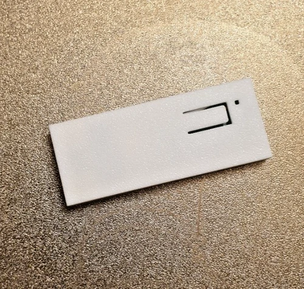
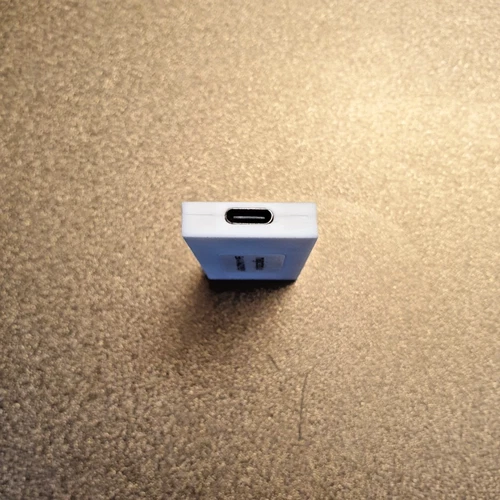
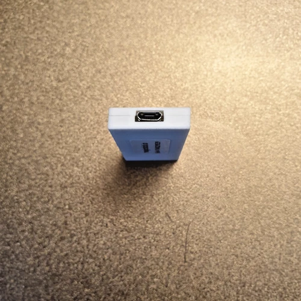
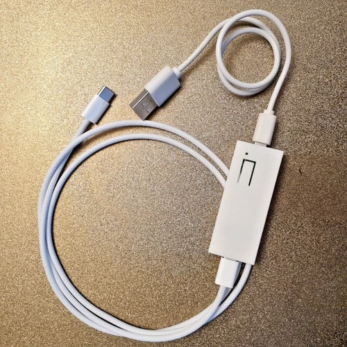
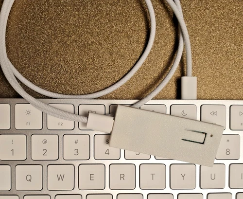

# magicstick
###### Apple Keyboard USB Adapter for PC

# About

Absolutely zero-hassle, USB adapter for connecting Apple keyboards (Magic 1, Magic 2 or the older Apple Wireless) to PCs, game consoles, smart TVs, etc. providing the correct keymap translation.

That is, you get a working _Delete_, _Ctrl_, _Page Up/Down_, _Print Screen_, Multimedia keys etc. You get dual connection modes, wired and Bluetooth.

You also get key programmability. You can remap keys to perform multimedia functions, type Unicode/Emojis and more.

All modern versions of Windows (since Windows 95 OSR2) and Linux are supported. Additionally, any device that accepts conventional USB keyboards should work with it, such as game consoles or smart TVs.

#### The magicstick USB dongle:

The dongle dimensions are 64×25×7mm. The USB cable connecting to the keyboard is optional as magicstick can also connect wiressly. There is one operation LED and a button.

This project started as a hobby as I wanted to use my Apple keyboard on Windows but without developing a dedicated Windows kernel-mode driver, especially given how difficult this is with the latest Windows kernel-mode driver signing restrictions (e.g. see my [WinAppleKey](https://github.com/samartzidis/WinAppleKey) project). 

## How to get a Device

You can purchase a plug-and-play dongle package from the [ebay magicstick-shop](https://www.ebay.co.uk/usr/magicstick-shop). Each item sold supports the _BBC Children in Need_ .

**Currently out of stock.**

## User Manual

The user manual is [here](docs/README.md).

## Supported Apple Keyboard Models

| Model | Status |
| -------- | ------- |
| A1314 | Old keyboard. Works, but no UI battery level indicator in magicstick-ui. |
| A1644, A1843, A2450, A3203| Fully supported. |
| A2449, A3118, A3119, A2520 | Supported - but without fingerprint sensor functionality. |

## Features

- Powered by a **133MHz dual-core Arm Cortex M0+** processor. All processing logic is implemented in **optimized C/C++** code and uses both processor cores (the dual USB stack is managed by the first core and the Bluetooth stack is managed by the second core).
- Works **both wired and wirelessly**. You can connect your Apple keyboard either via a standard USB to Lightning cable or wirelessly via Bluetooth. 
- You can freely switch between wired or wireless connection modes at any time.
- Wired and Bluetooth operation modes provide **surprisingly fast response times**. Tests performed with online measurement tools could not detect any extra delays over the default 16ms rebounce delay of a A1644 keyboard.

  
  
  _The above measurement was done on [clickspeedtester.com](https://www.clickspeedtester.com/keyboard-latency-test/) using an A1644 keyboard. It averaged the same between (all) MagicStick-wired, MagicStick-Bluetooth, and direct PC USB (that is without MagicStick and with no extra Windows drivers installed)_.
- Microcontroller-based device so it **works immediately** as soon as it is powered on. This allows you to use the keyboard as early as at the PC boot process, e.g. for accessing the BIOS/UEFI menus. Also since there is no Operating System driver required, the keyboard just works correctly in BIOS/UEFI mode.
- Embedded user programmable key rules engine, that allows you to directly **map** keys or key combinations to **custom multimedia** functions or **Unicode** characters (**μ**) and **Emojis** (👍). Please note that the Unicode/Emoji key mapping, by exception, only works in Windows and only with the support of a running magicstick-ui utility in the tray.
- OS **battery level indicator** in both wired and wireless connection modes in both **Windows** and **Linux**. Ubuntu Linux natively supports a battery-level indicator whereas for Windows you can use the [magicstick-ui](docs#the-magicstickui-utility) utility.
- Built with **security** in mind. Its HID interface is open (see magicstick-ui GitHub source code) and locked down to a standard keyboard HID API on the side that connects to the PC plus a few extra reports for monitoring the battery level and configuring keys. The Bluetooth connection has Level 2 security enabled (wireless encryption). Additionally, Bluetooth can be completely disabled if needed via settings.
- Contrast to other similar solutions (e.g. _MagicUtilities_), there are **no subscription fees** or other restrictions. You **own** the device, and you can connect it to **as many keyboards or computers** as you like.
- **PC sleep/wake-up** is supported and works **in both wired and Bluetooth** connection modes (in contrast to pure software solutions such as _MagicUtilities_). The Bluetooth wake-up support is particularly useful for media centre PCs that you would normally want to wake up from a distance when hitting a key on the keyboard. 
- **Firmware and tool updates**. Bug fixes and any future improvements, such as support for new keyboard models are easy to install and are provided for free (see _Releases_).

## Compliance and Safety

The device is built on a programmed Raspberry Pi Pico W microcontroller. Please refer to this official link for details on [compliance and safety approvals](https://pip.raspberrypi.com/categories/688).

## Disclaimer

This project was professionally developed with ❤️ and attention to detail, following software engineering best practices. There is no 100% guarantee however that it will work for your particular setup neither I accept responsibility for anything going wrong to your equipment (including explosions, earthquakes and floods) or to you directly or indirectly through its use. By accepting to use the device and related software you also accept full responsibility for all of the above. 

 

